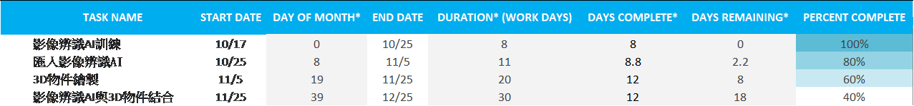
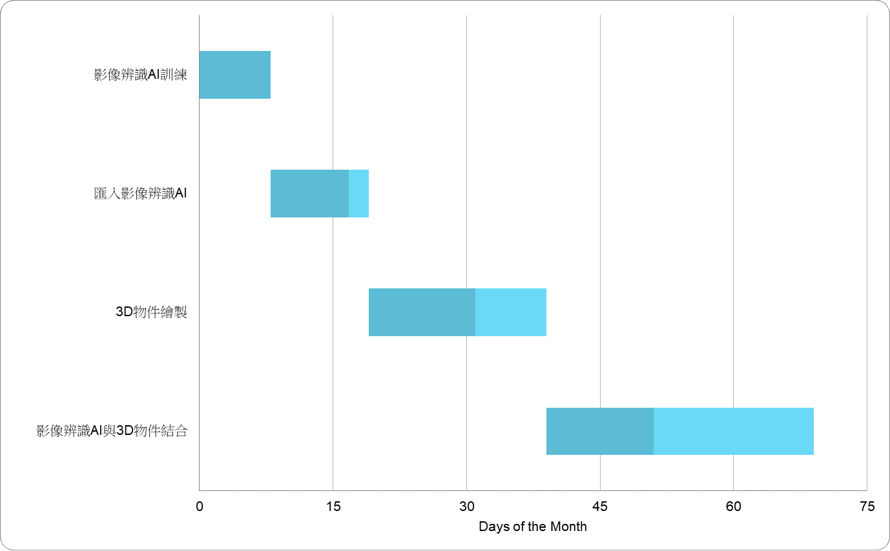

# A班：第七組 B班：第一組
## 小組成員：
> ### C107118106 沈育弘
> ### C107118206簡偉丞
> ### C107118212陳職凱
> ### C107118246吳柏志
> ### C107118250洪嘉聰
## 專題題目：互動遊戲開發
> 內容：製作一款3D遊戲，透過在鏡頭前擺出各種動作，遊戲內的角色會跟著做出對應的行動，
> 讓玩家體要顛覆傳統遊戲只能透過鍵盤或是手機操控的全新玩法，另外，也能透過這款遊戲來
> 達到另類的運動效果，透過各種動作的搭配，也能創造出各種不同的技能招式以及玩家與NPC
> 之間的互動，讓當前遊戲界邁向新的市場。
## 工作分配：
> ### 程式撰寫：簡偉丞 沈育弘 洪嘉聰
> ### 美　　編：陳職凱 吳柏志

> ### 功能性需求：
1.	遊戲每隔一段時間自動存檔，避免因為一些不可抗力因素，導致機器當機，遊戲資料遺失
2.	製作簡單清楚的遊戲說明，避免使用者不清楚遊戲如何遊玩
3.	製作清楚明瞭的遊戲介面

> ### 非功能性需求：
1.	系統要能清楚辨識使用者所做出的動作
2.	系統在看到使用者做出的動作後快速做出反應
3.	系統要方便維護與增加功能

---

|甘特圖|
|:--------:|

|CPM圖|

